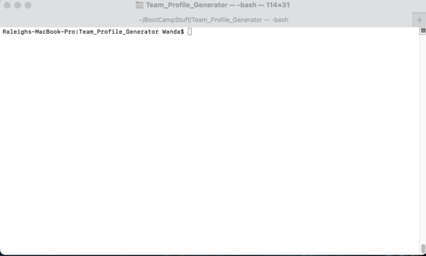
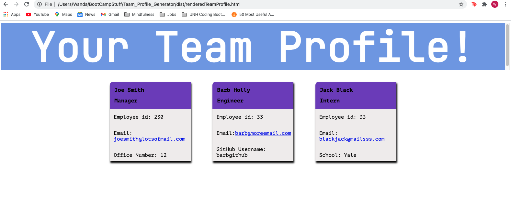

# Team_Profile_Generator
  # Table of Contents
  ## Description
  
  
   "License Badge"
  This app quickly and easily allows the user to input employee information  and generates an html page that displays this team rota.
  ## Installation
  Please install node.js and inquirer. This app is to be used directly from the command line in your terminal.
  ## Usage:
  This app is meant for casual use and an exercise in using JS, inquirer, node, html and CSS.
  ## Features:
  ## Visuals
  This gif shows the Team Profile Generator in use at the command line in Terminal.
  
  
  ## Contributing:
  If you would like to contribute, please fork off a new branch and submit a new Pull Request.
  ## Tests:
  This project has been tested using Jest.
  ## Email address:
  oglissane@gmail.com
  ## GitHub username:
  wmgleason
  ## License
  For more information on licenses and standards, click on the link below
  [License Badges](http://opensource.org/licenses)

  ## Questions or comments?
If you have any questions or would like to leave a comment, please see my GitHub page at:
- [My GitHub profile](https://github.com/wmgleason)
  
Or send me an email at:
oglissane@gmail.com
    
